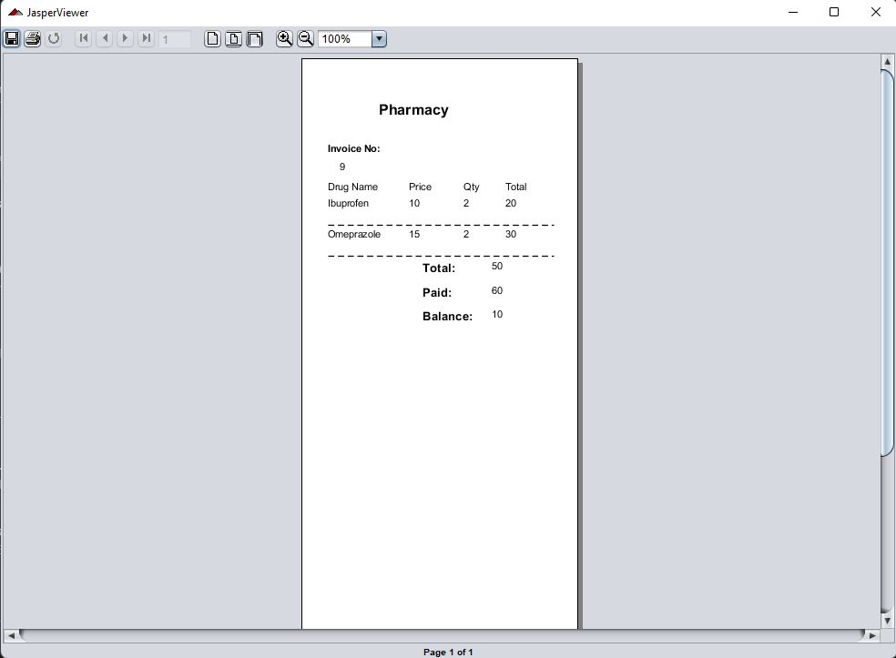

---
header-includes:
- \usepackage{fontspec}
- \usepackage{fvextra}
- \usepackage{accsupp}
- \setmainfont{Times New Roman}
- \setmonofont{Latin Modern Mono}
- \fvset{breaklines=true, breakanywhere=true}
- \DeclareRobustCommand\squelch[1]{\BeginAccSupp{method=plain,ActualText={}}#1\EndAccSupp{}}
- \renewcommand{\theFancyVerbLine}{\squelch{\textcolor[rgb]{0.0,0.0,0.0}{\small\arabic{FancyVerbLine}}}}
- \DefineVerbatimEnvironment{Highlighting}{Verbatim}{commandchars=\\\{\}, frame=leftline, numbersep=4pt, framesep=4pt}
fontsize: 10pt
geometry: left=3cm,right=3cm,top=1cm,bottom=2cm
---

\Large Code: \normalsize
```{.Java .numberLines}
class Testing
{
	public static void main(String args[])
	{
		System.out.pritnln("Hi There, How are you?");
	}
}
```

\Large Ouput: \normalsize
\newline

\newline \newline


